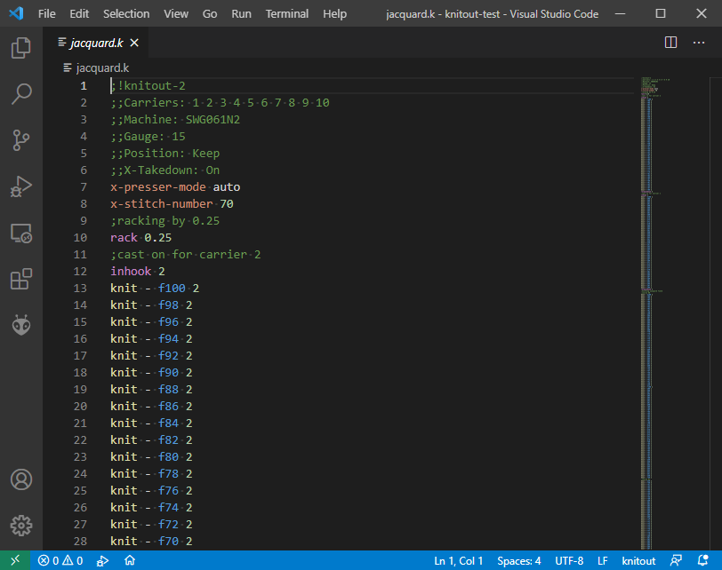

# Knitout for Visual Studio Code

Visual Studio Code extension for [Knitout](https://textiles-lab.github.io/knitout/knitout.html) file format.

## Features

Supports syntax highlighting in editor.



## Installation

### Using vsce

Use [vsce](https://github.com/microsoft/vsce) to create a vsix package. CD into the root of your copy of this repository and type

```
vsce package
```

This should generate a file named `vscode-knitout-0.0.1.vsix` in the current directory. Open VS Code and bring up the Extensions view by clicking on the Extensions icon in the *Activity Bar* on the side of VS Code or the *View: Extensions* command (`Ctrl+Shift+X`). Click on the three dots `...` at the upper right of the Extensions view (*Views and more Actions...*) and click *Install from VSIX*. Browse to your vsix file and open it. You should now be able to see the **Knitout** extension in the Extension view.

### Installing manually

Shut down all instances of VS Code. Browse to your VS Code extension folder, which is locted at `%USERPROFILE%\.vscode\extensions`. Create a new folder named `ithrak.vscode-knitout-0.0.1`. Copy the content of this package into this folder. Files required are:

* `images/icon.png`
* `images/screenshot.png`
* `syntaxes/knitout.tmLanguage.json`
* `syntaxes/knitout-configuration.json`
* `CHANGELOG.md`
* `LICENSE.txt`
* `package.json`
* `README.md`

Restart VS Code. You should now be able to see the **Knitout** extension in the Extension view.

## Known Issues

Magic string and Comment Header are treated as regular comment.

## Release Notes

### 0.0.1

Initial release.

